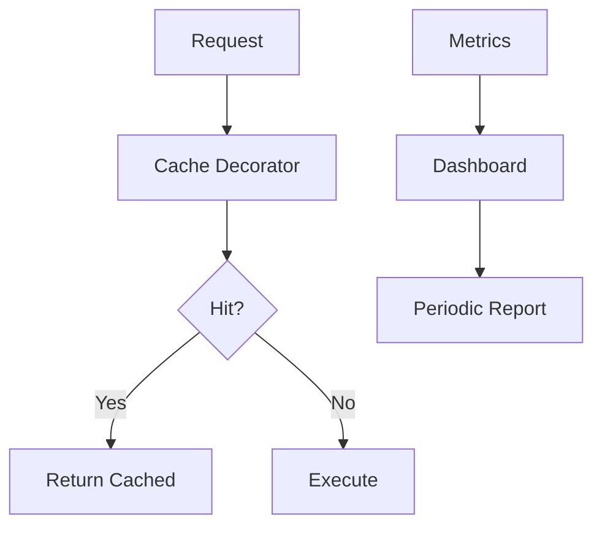

# 07 Dashboard Pattern

Quickly understand if this example fits your needs.



## What it does

Demonstrates building a monitoring dashboard that displays cache metrics at regular intervals with reset functionality.

## When to use it

- When implementing cache monitoring in production
- When tracking metrics over specific time periods
- When needing to reset metrics between monitoring cycles

## Code

```python
# Copy and adapt to your needs
import redis
from wredis.decorators import cache, CacheMetrics

redis_client = redis.Redis(host="localhost", port=6379, db=0, decode_responses=True)
metrics = CacheMetrics()


@cache(ttl=300, prefix="dashboard", redis_client=redis_client, metrics=metrics)
def obtener_datos_widget(widget_id: str) -> dict:
    """Simulates fetching data for a dashboard widget."""
    return {"widget": widget_id, "datos": f"datos_del_widget_{widget_id}"}


def imprimir_dashboard(metrics: CacheMetrics, ciclo: int) -> None:
    """Prints a snapshot of cache status."""
    total = metrics.hits + metrics.misses
    print(f"\n=== Cache Dashboard - Cycle #{ciclo} ===")
    print(f"  Hits: {metrics.hits}, Misses: {metrics.misses}")
    print(f"  Total requests: {total}, Hit Rate: {metrics.hit_rate:.1f}%")


# Simulate activity cycles
widgets = ["ventas", "usuarios", "trafico", "ventas", "usuarios", "ventas"]

for ciclo, widget in enumerate(widgets, 1):
    obtener_datos_widget(widget)
    imprimir_dashboard(metrics, ciclo)

# Reset metrics for new period
print("\n=== Metrics reset for new period ===")
metrics.reset()
imprimir_dashboard(metrics, "post-reset")

# New cycle with clean metrics
obtener_datos_widget("ventas")
obtener_datos_widget("ventas")
imprimir_dashboard(metrics, "new period")

redis_client.close()
```

## Run it

```bash
python example.py
```

## Expected output

Shows periodic dashboard snapshots with metrics and demonstrates metrics reset between periods.