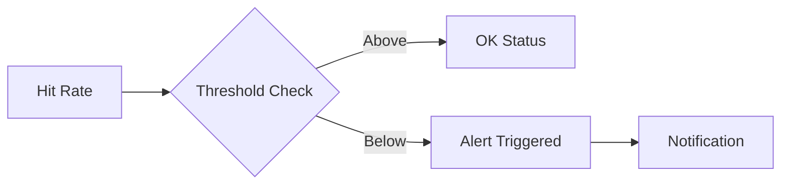

# 08 Alerting on Low Hit Rate

Quickly understand if this example fits your needs.



## What it does

Implements an alerting system that monitors hit rate and triggers alerts when it falls below a configurable threshold.

## When to use it

- When monitoring cache health in production
- When implementing SLAs for cache performance
- When automating responses to cache problems

## Code

```python
# Copy and adapt to your needs
import redis
from wredis.decorators import cache, CacheMetrics

redis_client = redis.Redis(host="localhost", port=6379, db=0, decode_responses=True)
metrics = CacheMetrics()

# Minimum acceptable hit rate threshold
ALERT_THRESHOLD = 50.0


@cache(ttl=300, prefix="api", redis_client=redis_client, metrics=metrics)
def consultar_api(endpoint: str) -> dict:
    """Simulates external API query."""
    return {"endpoint": endpoint, "respuesta": "datos_api"}


def verificar_alerta(metrics: CacheMetrics, umbral: float) -> None:
    """Checks if hit rate is below threshold."""
    if metrics.hits + metrics.misses == 0:
        print("  [INFO] Not enough data yet to evaluate")
        return

    if metrics.hit_rate < umbral:
        print(f"  [ALERT] Hit rate {metrics.hit_rate:.1f}% < {umbral}% - Possible cache problem")
    else:
        print(f"  [OK] Hit rate {metrics.hit_rate:.1f}% >= {umbral}% - Cache healthy")


# Simulate scenario with low hit rate
print("=== Scenario 1: Access to many unique endpoints ===")
endpoints_unicos = [f"/api/recurso/{i}" for i in range(5)]
for ep in endpoints_unicos:
    consultar_api(ep)
    verificar_alerta(metrics, ALERT_THRESHOLD)

# Reset and simulate healthy scenario
metrics.reset()
print("\n=== Scenario 2: Repeated access to few endpoints ===")
endpoints_repetidos = ["/api/usuarios", "/api/usuarios", "/api/usuarios", "/api/productos", "/api/productos"]
for ep in endpoints_repetidos:
    consultar_api(ep)
    verificar_alerta(metrics, ALERT_THRESHOLD)

print(f"\n=== Final Summary ===")
print(f"Metrics: {metrics}")

redis_client.close()
```

## Run it

```bash
python example.py
```

## Expected output

Shows alerts triggered when hit rate falls below 50%, and OK status when hit rate is healthy.