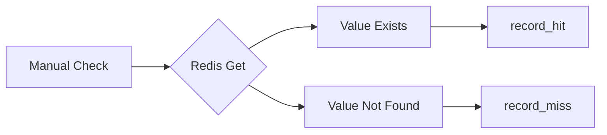

# 09 Manual Recording

Quickly understand if this example fits your needs.



## What it does

Shows how to manually track cache operations using record_hit(), record_miss(), and record_error() methods.

## When to use it

- When implementing custom cache logic outside the decorator
- When tracking non-decorator cache operations
- When integrating with existing caching systems

## Code

```python
# Copy and adapt to your needs
import redis
from wredis.decorators import CacheMetrics

metrics = CacheMetrics()


def obtener_de_cache_manual(clave: str, redis_client) -> str | None:
    """Attempts to get a value from cache manually."""
    try:
        valor = redis_client.get(clave)
        if valor is not None:
            metrics.record_hit()
            return valor.decode()
        else:
            metrics.record_miss()
            return None
    except Exception:
        metrics.record_error()
        return None


def guardar_en_cache_manual(clave: str, valor: str, redis_client, ttl: int = 300) -> None:
    """Manually saves a value to cache."""
    redis_client.setex(clave, ttl, valor)


redis_client = redis.Redis(host="localhost", port=6379, db=0, decode_responses=True)

print("=== Manual cache operations ===")

# First attempt: miss
resultado = obtener_de_cache_manual("config:app_name", redis_client)
print(f"Attempt 1 (miss): {resultado}")

# Save to cache
guardar_en_cache_manual("config:app_name", "MiAplicacion", redis_client)
print("  -> Saved to cache")

# Second attempt: hit
resultado = obtener_de_cache_manual("config:app_name", redis_client)
print(f"Attempt 2 (hit): {resultado}")

# Third attempt: hit
resultado = obtener_de_cache_manual("config:app_name", redis_client)
print(f"Attempt 3 (hit): {resultado}")

# Attempt with non-existent key: miss
resultado = obtener_de_cache_manual("config:inexistente", redis_client)
print(f"Attempt 4 (miss): {resultado}")

print(f"\n=== Final Metrics ===")
print(f"Hits: {metrics.hits}, Misses: {metrics.misses}, Errors: {metrics.errors}")
print(f"Hit rate: {metrics.hit_rate:.1f}%")

redis_client.close()
```

## Run it

```bash
python example.py
```

## Expected output

Shows manual tracking of cache operations with 2 hits and 2 misses.