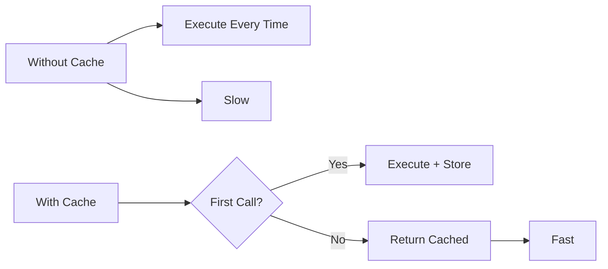

# 11 Performance Comparison

Quickly understand if this example fits your needs.



## What it does

Compares execution time between cached and non-cached functions, demonstrating the performance benefits of caching.

## When to use it

- When measuring cache performance impact
- When justifying cache implementation
- When optimizing expensive operations

## Code

```python
# Copy and adapt to your needs
import time
import redis
from wredis.decorators import cache, CacheMetrics

redis_client = redis.Redis(host="localhost", port=6379, db=0, decode_responses=True)
metrics = CacheMetrics()


def operacion_costosa_sin_cache(n: int) -> int:
    """Expensive operation without cache."""
    time.sleep(0.01)
    return sum(i * i for i in range(n))


@cache(ttl=600, prefix="benchmark", redis_client=redis_client, metrics=metrics)
def operacion_costosa_con_cache(n: int) -> int:
    """Same operation but with cache."""
    time.sleep(0.01)
    return sum(i * i for i in range(n))


# Benchmark without cache
print("=== Without cache ===")
inicio = time.time()
for _ in range(5):
    operacion_costosa_sin_cache(1000)
tiempo_sin_cache = time.time() - inicio
print(f"Total time: {tiempo_sin_cache:.4f}s")

# Benchmark with cache
print("\n=== With cache ===")
inicio = time.time()
for _ in range(5):
    operacion_costosa_con_cache(1000)
tiempo_con_cache = time.time() - inicio
print(f"Total time: {tiempo_con_cache:.4f}s")

print(f"\n=== Cache metrics ===")
print(f"Hits: {metrics.hits}")
print(f"Misses: {metrics.misses}")
print(f"Hit rate: {metrics.hit_rate:.1f}%")
print(f"Performance improvement: {tiempo_sin_cache / tiempo_con_cache:.1f}x faster")

redis_client.close()
```

## Run it

```bash
python example.py
```

## Expected output

Shows cached version is ~5x faster with 1 miss and 4 hits.
