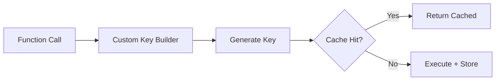

# 12 Custom Key Builder

Quickly understand if this example fits your needs.



## What it does

Demonstrates using custom key builder functions with the cache decorator to control how cache keys are generated.

## When to use it

- When default key generation doesn't fit your needs
- When you need more control over cache key structure
- When implementing custom caching strategies

## Code

```python
# Copy and adapt to your needs
import redis
from wredis.decorators import cache, CacheMetrics

redis_client = redis.Redis(host="localhost", port=6379, db=0, decode_responses=True)
metrics = CacheMetrics()


def mi_key_builder(func, args, kwargs) -> str:
    """Custom cache key builder."""
    return f"custom:{func.__name__}:{args[0]}"


@cache(ttl=300, prefix="app", key_builder=mi_key_builder, redis_client=redis_client, metrics=metrics)
def buscar_usuario(username: str) -> dict:
    """Searches user by username."""
    return {"username": username, "email": f"{username}@ejemplo.com"}


@cache(ttl=300, prefix="app", key_builder=mi_key_builder, redis_client=redis_client, metrics=metrics)
def buscar_producto(sku: str) -> dict:
    """Searches product by SKU."""
    return {"sku": sku, "nombre": f"Producto_{sku}"}


# Test with custom keys
print("=== Searches with custom key builder ===")

print("\n--- Search users ---")
buscar_usuario("juan")  # miss
buscar_usuario("juan")  # hit
buscar_usuario("maria")  # miss

print("\n--- Search products ---")
buscar_producto("SKU001")  # miss
buscar_producto("SKU001")  # hit

# Verify keys in Redis
print("\n=== Keys in Redis ===")
for clave in redis_client.keys("app:*"):
    print(f"  {clave.decode()}")

print(f"\n=== Metrics ===")
print(f"Hits: {metrics.hits}, Misses: {metrics.misses}, Hit rate: {metrics.hit_rate:.1f}%")

redis_client.close()
```

## Run it

```bash
python example.py
```

## Expected output

Shows custom key format in Redis and metrics with 3 hits and 3 misses.