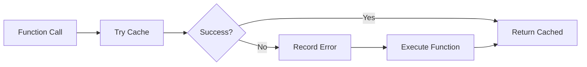

# 13 Error Handling Metrics

Quickly understand if this example fits your needs.



## What it does

Demonstrates how cache errors are tracked in metrics and how the function continues to work despite cache failures.

## When to use it

- When monitoring cache error rates
- When implementing fault-tolerant caching
- When debugging cache-related issues

## Code

```python
# Copy and adapt to your needs
import unittest.mock
import redis
from wredis.decorators import cache, CacheMetrics
from wredis._exceptions import CacheError

redis_client = redis.Redis(host="localhost", port=6379, db=0, decode_responses=True)
metrics = CacheMetrics()


@cache(ttl=300, prefix="datos", redis_client=redis_client, metrics=metrics)
def obtener_datos_seguros(key: str) -> dict:
    """Function that works even if cache fails."""
    return {"key": key, "valor": f"valor_para_{key}"}


# Normal operations
print("=== Normal operations ===")
resultado = obtener_datos_seguros("config1")
print(f"Result: {resultado}")

resultado = obtener_datos_seguros("config1")
print(f"Result (cache hit): {resultado}")

# Simulate cache error
print("\n=== Simulating cache error ===")
with unittest.mock.patch.object(redis_client, "get", side_effect=redis.RedisError("simulated connection error")):
    try:
        resultado = obtener_datos_seguros("config2")
        print(f"Result: {resultado}")
    except CacheError as e:
        print(f"Cache error captured: {e}")

print(f"Metrics after error: {metrics}")
print(f"Errors recorded: {metrics.errors}")

# Reset metrics
print("\n=== Metrics reset ===")
metrics.reset()
print(f"Metrics after reset: {metrics}")

redis_client.close()
```

## Run it

```bash
python example.py
```

## Expected output

Shows normal operation, then error tracking when cache fails, with error count incremented.
