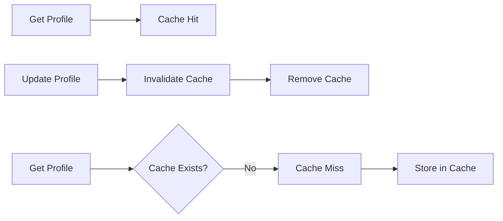

# 14 Invalidation Decorator

Quickly understand if this example fits your needs.



## What it does

Demonstrates using the @invalidate_cache decorator with @cache to automatically invalidate cache when data is updated.

## When to use it

- When implementing cache invalidation on data updates
- When tracking metrics impact of invalidation
- When building data consistency strategies

## Code

```python
# Copy and adapt to your needs
import redis
from wredis.decorators import cache, invalidate_cache, CacheMetrics

redis_client = redis.Redis(host="localhost", port=6379, db=0, decode_responses=True)
metrics = CacheMetrics()


@cache(ttl=600, prefix="perfil", redis_client=redis_client, metrics=metrics)
def obtener_perfil_usuario(user_id: int) -> dict:
    """Gets user profile."""
    return {"user_id": user_id, "nombre": f"Usuario_{user_id}", "email": f"user{user_id}@test.com"}


@invalidate_cache(pattern="perfil:*", redis_client=redis_client)
def actualizar_perfil(user_id: int, nuevos_datos: dict) -> dict:
    """Updates profile and invalidates cache."""
    perfil = {"user_id": user_id, **nuevos_datos}
    print(f"  [DB] Profile updated: {perfil}")
    return perfil


# Complete workflow
print("=== 1. Get profile (miss) ===")
perfil = obtener_perfil_usuario(1)
print(f"Metrics: {metrics}")

print("\n=== 2. Get profile again (hit) ===")
perfil = obtener_perfil_usuario(1)
print(f"Metrics: {metrics}")

print("\n=== 3. Update profile (invalidates cache) ===")
actualizar_perfil(1, {"nombre": "Usuario_Actualizado"})
print(f"Metrics after invalidation: {metrics}")

print("\n=== 4. Get profile after invalidation (miss) ===")
perfil = obtener_perfil_usuario(1)
print(f"Metrics: {metrics}")

print(f"\n=== Summary ===")
print(f"Total hits: {metrics.hits}, Total misses: {metrics.misses}, Hit rate: {metrics.hit_rate:.1f}%")

redis_client.close()
```

## Run it

```bash
python example.py
```

## Expected output

Shows hit count dropping from 1 to 0 after invalidation, then recovering after cache repopulation.
