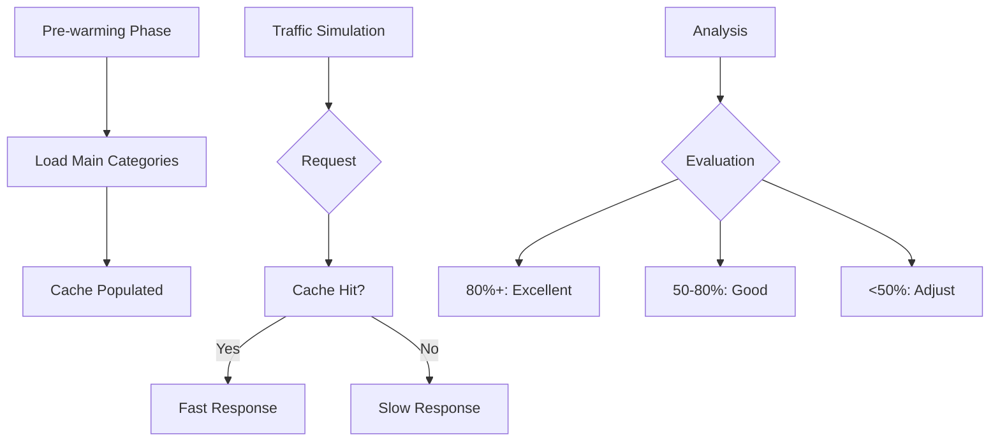

# 15 Advanced Cache Warming

Quickly understand if this example fits your needs.



## What it do

Implements a comprehensive cache warming strategy with detailed metrics tracking and effectiveness evaluation.

## When to use it

- When implementing production-grade cache warming
- When analyzing cache strategy effectiveness
- When optimizing for high-traffic scenarios

## Code

```python
# Copy and adapt to your needs
import redis
from wredis.decorators import cache, CacheMetrics

redis_client = redis.Redis(host="localhost", port=6379, db=0, decode_responses=True)
metrics = CacheMetrics()


@cache(ttl=600, prefix="catalogo", redis_client=redis_client, metrics=metrics)
def obtener_categoria(categoria_id: int) -> dict:
    """Gets category data from catalog."""
    return {"categoria_id": categoria_id, "nombre": f"Categoria_{categoria_id}", "productos": categoria_id * 10}


def precalentar_categorias(categorias_ids: list[int]) -> None:
    """Pre-warms cache with specified categories."""
    print("=== Starting pre-warming ===")
    for cat_id in categorias_ids:
        obtener_categoria(cat_id)
        print(f"  Pre-warmed category {cat_id}")


def simular_trafico(categoria_ids: list[int]) -> None:
    """Simulates real user traffic accessing categories."""
    print("\n=== Simulating traffic ===")
    for cat_id in categoria_ids:
        resultado = obtener_categoria(cat_id)
        print(f"  Access to category {cat_id}: {resultado['nombre']}")


def analizar_efectividad(metrics: CacheMetrics) -> None:
    """Analyzes pre-warming effectiveness."""
    print("\n=== Effectiveness analysis ===")
    total = metrics.hits + metrics.misses
    if total == 0:
        print("  No data to analyze")
        return

    print(f"  Total requests: {total}")
    print(f"  Hits: {metrics.hits}, Misses: {metrics.misses}")
    print(f"  Hit rate: {metrics.hit_rate:.1f}%")

    if metrics.hit_rate >= 80:
        print("  Evaluation: EXCELLENT")
    elif metrics.hit_rate >= 50:
        print("  Evaluation: GOOD")
    else:
        print("  Evaluation: REGULAR - Consider adjusting")


# Execute complete strategy
print("=== Cache Warming Strategy ===\n")

categorias_principales = [1, 2, 3, 4, 5]
precalentar_categorias(categorias_principales)

trafico_simulado = [1, 2, 1, 3, 1, 2, 4, 5, 1, 3]
simular_trafico(trafico_simulado)

analizar_efectividad(metrics)

redis_client.close()
```

## Run it

```bash
python example.py
```

## Expected output

Shows pre-warming phase, traffic simulation, and effectiveness analysis with hit rate around 80%.