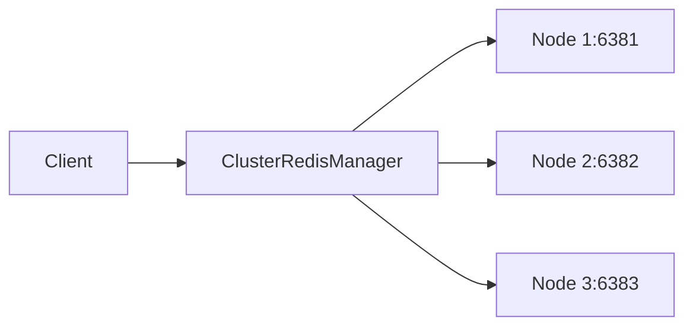

# Cluster Redis Manager - Basic Example

This example demonstrates how to use the `ClusterRedisManager` to connect to a Redis cluster and perform basic operations.

## Architecture



## Description

The `ClusterRedisManager` manages connections to a Redis cluster, handling:
- Multiple startup nodes for cluster discovery
- Automatic failover and node routing
- Cluster state management

## Code

```python
from wredis.ha import ClusterRedisManager

startup_nodes = [
    ("localhost", 6381),
    ("localhost", 6382),
    ("localhost", 6383),
]

manager = ClusterRedisManager(startup_nodes=startup_nodes)

state = manager.get_cluster_state()
print(f"Cluster state: {state}")

info = manager.get_cluster_info()
print(f"Cluster info: {info}")

manager.cluster.set("key1", "value1")
manager.cluster.set("key2", "value2")

value1 = manager.cluster.get("key1")
value2 = manager.cluster.get("key2")

print(f"key1: {value1}, key2: {value2}")
```

## Run Instructions

1. Start a Redis cluster with nodes on ports 6381, 6382, 6383
2. Run the example:
   ```bash
   python examples/sync/cluster/01_basic/example.py
   ```
