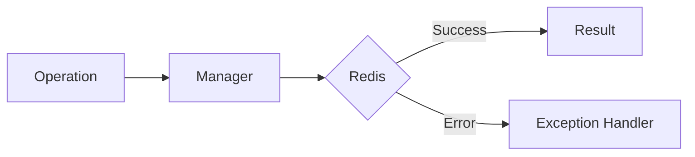

# 01 Base Exception

## Description

Demonstrates the WRedisError base exception class, which is the parent class for all exceptions in the wredis library. Shows how to use it as a generic error handler and how to create custom exceptions that inherit from it.



## Code

```python
"""Base exception WRedisError demonstration.

Shows how WRedisError is the base class for all exceptions
in wredis and how it can be used as a generic catch point.
"""

from wredis._exceptions import WRedisError


# Throw the base exception directly
try:
    raise WRedisError("Generic WRedis Error")
except WRedisError as exc:
    print(f"Exception type: {type(exc).__name__}")
    print(f"Message: {exc}")
    print(f"Is instance of Exception? {isinstance(exc, Exception)}")


# Create custom subclasses that inherit from WRedisError
class MyCustomError(WRedisError):
    """Custom exception for my application."""


try:
    raise MyCustomError("Something went wrong in my app")
except WRedisError as exc:
    print(f"\nCaught as WRedisError: {exc}")
    print(f"Real type: {type(exc).__name__}")

# Verify that WRedisError inherits directly from Exception
print(f"\nWRedisError.__bases__: {WRedisError.__bases__}")
print("The base exception works correctly.")
```

## Run

```bash
python example.py
```
