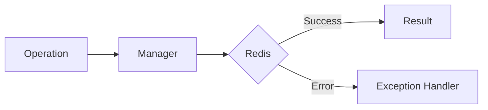

# 02 Exception Hierarchy

## Description

Demonstrates the complete exception hierarchy in WRedis. Shows all exception classes and how they inherit from the base WRedisError class.



## Code

```python
"""WRedis complete exception hierarchy demonstration.

Programmatically traverses the exception tree to visualize
how all specialized exceptions inherit from WRedisError.
"""

import inspect

from wredis import _exceptions


def show_hierarchy():
    """Prints the inheritance tree of WRedis exceptions."""
    base = _exceptions.WRedisError
    print("WRedis Exception Hierarchy:")
    print(f"  {base.__name__} (base)")

    # Get all classes in the module that inherit from WRedisError
    for name, cls in inspect.getmembers(_exceptions, inspect.isclass):
        if issubclass(cls, base) and cls is not base:
            print(f"    └── {name}")
            # Show own attributes if any
            if cls.__doc__:
                print(f"        Doc: {cls.__doc__}")


show_hierarchy()

# Verify inheritance relationships
from wredis._exceptions import (
    CacheError,
    ClusterError,
    OperationError,
    PubSubError,
    QueueError,
    RedisConnectionError,
    SentinelError,
    SerializationError,
    StreamError,
    TransactionError,
    ValidationError,
    WRedisError,
)

exceptions = [
    RedisConnectionError,
    SerializationError,
    CacheError,
    SentinelError,
    ClusterError,
    ValidationError,
    OperationError,
    TransactionError,
    QueueError,
    StreamError,
    PubSubError,
]

print("\nInheritance verification:")
for exc_cls in exceptions:
    is_subclass = issubclass(exc_cls, WRedisError)
    print(f"  {exc_cls.__name__} -> WRedisError: {is_subclass}")
```

## Run

```bash
python example.py
```