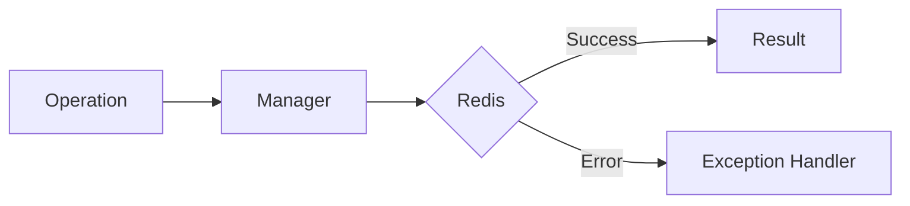

# 03 Catching Specific Errors

## Description

Demonstrates how to catch specific WRedis exceptions using try/except blocks, handling each error type differently based on the exception class.



## Code

```python
"""Specific error catching demonstration with try/except.

Shows how to catch individual WRedis exceptions
to handle each error type differently.
"""

from wredis._exceptions import (
    CacheError,
    OperationError,
    RedisConnectionError,
    ValidationError,
)


def simulate_operation(error_type):
    """Simulates an operation that can fail in different ways.

    Args:
        error_type: The exception type to raise.

    Raises:
        The specified exception.
    """
    raise error_type(f"Simulated error: {error_type.__name__}")


# Catch each error type separately
types_to_test = [
    RedisConnectionError,
    ValidationError,
    CacheError,
    OperationError,
]

for tipo in types_to_test:
    try:
        simulate_operation(tipo)
    except RedisConnectionError as exc:
        print(f"[CONNECTION] Could not connect: {exc}")
    except ValidationError as exc:
        print(f"[VALIDATION] Invalid data: {exc}")
    except CacheError as exc:
        print(f"[CACHE] Cache failure: {exc}")
    except OperationError as exc:
        print(f"[OPERATION] Operation error: {exc}")

# Demonstrate that the order of except blocks matters
print("\n--- Correct catch order ---")
try:
    raise RedisConnectionError("Server unavailable")
except RedisConnectionError as exc:
    # This block executes first because it is more specific
    print(f"Caught as RedisConnectionError: {exc}")

# If WRedisError is caught first, specific blocks would never execute
print("\n--- Incorrect order (WRedisError first) ---")
from wredis._exceptions import WRedisError

try:
    raise RedisConnectionError("Server unavailable")
except WRedisError as exc:
    # Catches EVERYTHING, specific blocks below would not execute
    print(f"Caught as WRedisError (too generic): {exc}")
```

## Run

```bash
python example.py
```