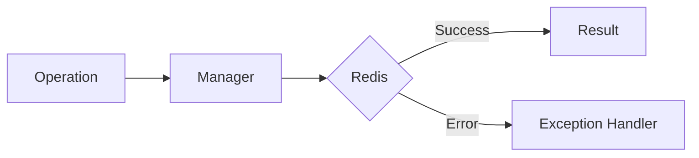

# 06 Validation Error Handling

## Description

Demonstrates how to use ValidationError for input validation before sending data to Redis, showing various validation scenarios.



## Code

See `example.py`

## Run

```bash
python example.py
```
