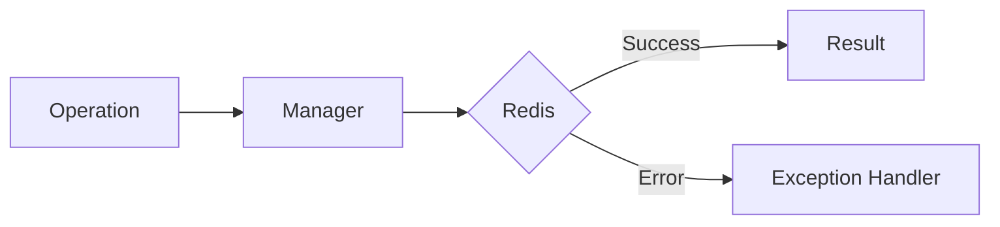

# 07 Operation Error Recovery

## Description

Demonstrates recovery strategies for OperationError including retries and fallback to default values.



## Code

See `example.py`

## Run

```bash
python example.py
```