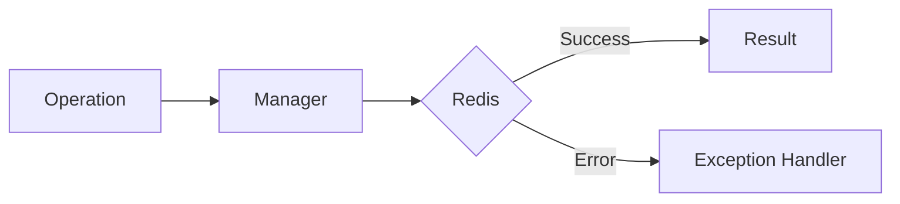

# 08 Transaction Error Handling

## Description

Demonstrates handling of TransactionError including WATCH conflicts and optimistic locking with retries.



## Code

See `example.py`

## Run

```bash
python example.py
```