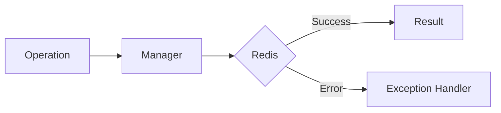

# 09 Serialization Error Handling

## Description

Demonstrates handling of SerializationError including serialization failures, corrupted JSON, and fallback strategies.



## Code

See `example.py`

## Run

```bash
python example.py
```