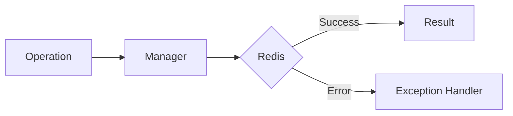

# 10 Logging Integration

## Description

Demonstrates integrating WRedis exceptions with Python's logging module for audit trails and diagnostics.



## Code

See `example.py`

## Run

```bash
python example.py
```