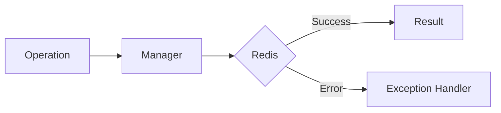

# 11 Retry on Specific Errors

## Description

Demonstrates automatic retry mechanism with a decorator that only retries specific exception types (RedisConnectionError, OperationError) while immediately propagating others like ValidationError.



## Code

See `example.py`

## Run

```bash
python example.py
```