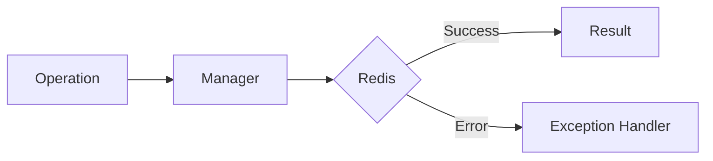

# 12 Graceful Degradation

## Description

Demonstrates graceful degradation pattern where the application continues to function with reduced capabilities (using in-memory fallback) when Redis is unavailable.



## Code

See `example.py`

## Run

```bash
python example.py
```