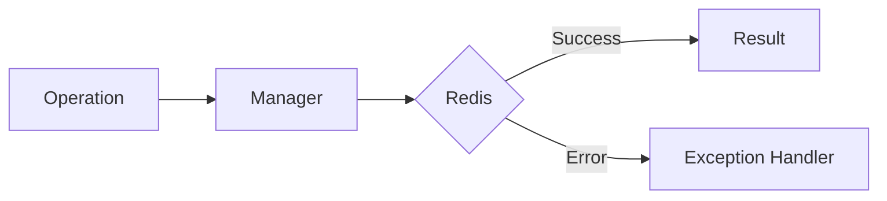

# 13 Queue Error Handling

## Description

Demonstrates handling of QueueError for queue operations including push, pop, peek, and scenarios like full queue, empty queue, and invalid elements.



## Code

See `example.py`

## Run

```bash
python example.py
```