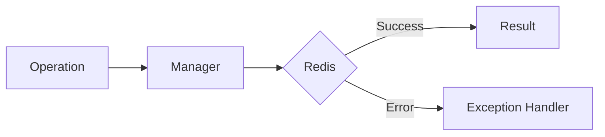

# 14 Stream and PubSub Errors

## Description

Demonstrates handling of StreamError and PubSubError for Redis Streams and Pub/Sub operations, including corrupted streams, invalid data, and connection issues.



## Code

See `example.py`

## Run

```bash
python example.py
```
