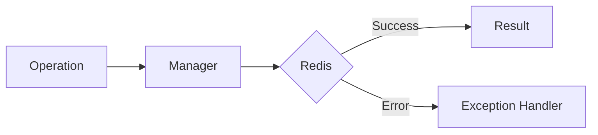

# 15 Custom Error Handler

## Description

Demonstrates creating centralized and reusable error handlers for WRedis exceptions, including a handler class with registered callbacks and a decorator pattern for automatic error handling.



## Code

See `example.py`

## Run

```bash
python example.py
```