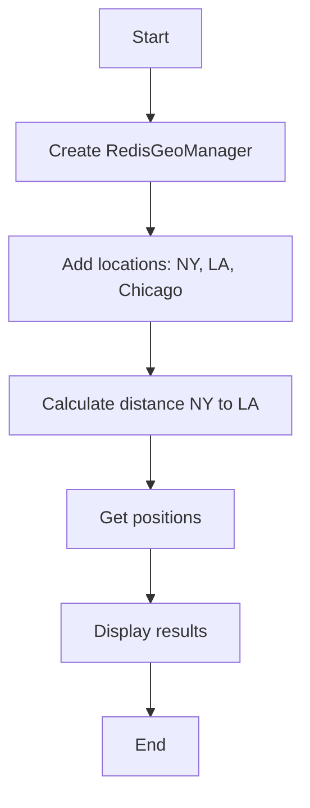

# Geo Basic Example

## Description

This example demonstrates basic geo operations using `RedisGeoManager`. It shows how to add locations and calculate distances between them.

## Diagram



## Code

```python
from wredis.geo import RedisGeoManager

geo_manager = RedisGeoManager(host="localhost")

geo_manager.add_location("cities", "new_york", -74.006, 40.7128)
geo_manager.add_location("cities", "los_angeles", -118.2437, 34.0522)
geo_manager.add_location("cities", "chicago", -87.6298, 41.8781)

distance = geo_manager.get_distance("cities", "new_york", "los_angeles", unit="km")
print(f"Distance NY to LA: {distance} km")

positions = geo_manager.get_positions("cities", "new_york", "chicago")
print(f"Positions: {positions}")
```

## Run Instructions

```bash
python example.py
```
