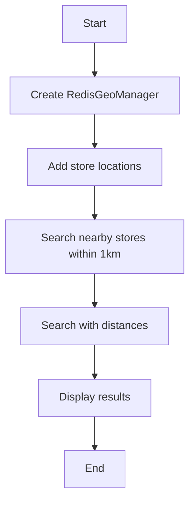

# Geo Search Example

## Description

This example demonstrates searching for nearby locations using `RedisGeoManager`.

## Diagram



## Code

```python
from wredis.geo import RedisGeoManager

geo_manager = RedisGeoManager(host="localhost")

geo_manager.add_location("places", "store_a", -122.4194, 37.7749)
geo_manager.add_location("places", "store_b", -122.4084, 37.7849)
geo_manager.add_location("places", "store_c", -122.4294, 37.7649)

nearby = geo_manager.search_nearby("places", -122.4194, 37.7749, 1, unit="km", count=5)
print(f"Stores within 1km: {nearby}")

nearby_with_dist = geo_manager.search_nearby_with_distance("places", -122.4194, 37.7749, 2, unit="km")
for place, dist in nearby_with_dist:
    print(f"{place}: {dist:.2f} km")
```

## Run Instructions

```bash
python example.py
```
