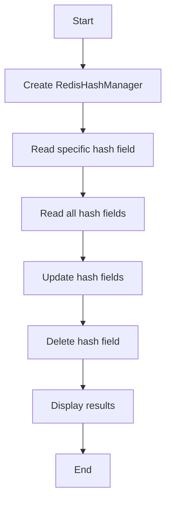

# Hash Read Example

## Description

This example demonstrates reading data from Redis hashes using `RedisHashManager`.

## Diagram



## Code

```python
from wredis.hash import RedisHashManager

if __name__ == "__main__":
    redis_manager = RedisHashManager(host="localhost", verbose=False)


    user1 = redis_manager.read_hash("my_hash", "user:1")
    print(f"User 1: {user1}")

    all_users = redis_manager.read_all_hash("my_hash")
    print(f"All users: {all_users}")

    redis_manager.update_hash(
        "my_hash", "user:3", {"name": "William", "age": 35, "gender": "male"}
    )

    redis_manager.update_hash(
        "my_hash", "user:5", {"name": "William", "age": 35, "gender": "male"}
    )

    redis_manager.delete_hash_field("my_hash", "user:2")

    all_users_after_deletion = redis_manager.read_all_hash("my_hash")
    print(f"Users after deletion: {all_users_after_deletion}")
```

## Run Instructions

```bash
python example.py
```
