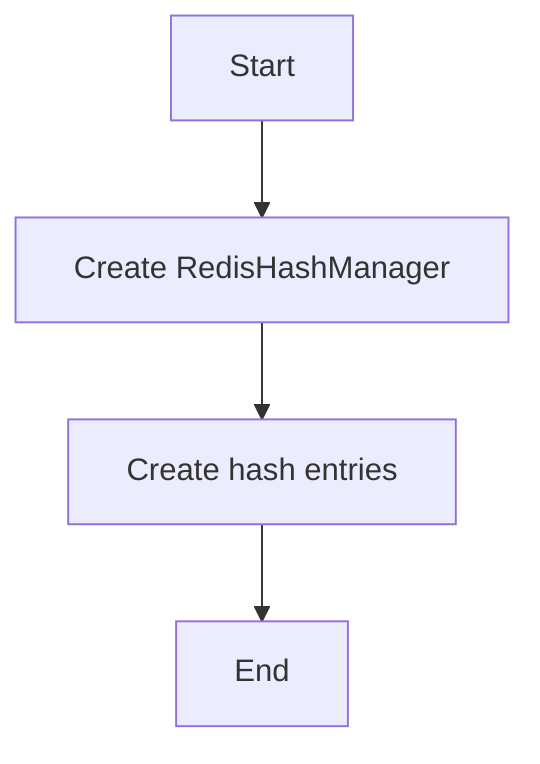

# Hash Create Example

## Description

This example demonstrates creating Redis hashes using `RedisHashManager`.

## Diagram



## Code

```python
from wredis.hash import RedisHashManager

if __name__ == "__main__":
    redis_manager = RedisHashManager(host="localhost")

    redis_manager.create_hash("my_hash", "user:1", {"name": "Alice", "age": 30}, ttl=60)
    redis_manager.create_hash("my_hash", "user:2", {"name": "Bob", "age": 25})
    redis_manager.create_hash("my_hash", "user:3", {"name": "Bob", "age": 25})
    redis_manager.create_hash("my_hash", "user:4", {"name": "Bob", "age": 25})
```

## Run Instructions

```bash
python example.py
```
