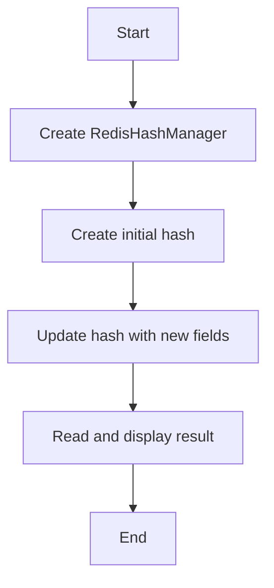

# Hash Update Example

## Description

This example demonstrates updating fields in a Redis hash using `RedisHashManager`.

## Diagram



## Code

```python
from wredis.hash import RedisHashManager


def main():
    manager = RedisHashManager(host="localhost", verbose=False)

    manager.create_hash("user:1", "profile", {"name": "Alice", "age": 30})

    manager.update_hash("user:1", "profile", {"city": "Madrid", "country": "Spain"})

    result = manager.read_hash("user:1", "profile")
    print(f"Updated hash: {result}")


if __name__ == "__main__":
    main()
```

## Run Instructions

```bash
python example.py
```
