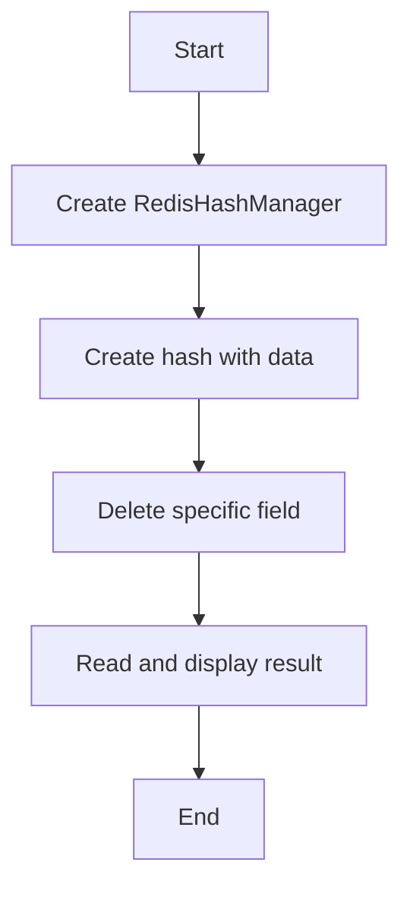

# Hash Delete Example

## Description

This example demonstrates deleting fields from a Redis hash using `RedisHashManager`.

## Diagram



## Code

```python
from wredis.hash import RedisHashManager


def main():
    manager = RedisHashManager(host="localhost", verbose=False)

    manager.create_hash("user:2", "data", {"name": "Bob", "age": 25})

    manager.delete_hash_field("user:2", "age")

    result = manager.read_all_hash("user:2")
    print(f"Hash after deletion: {result}")


if __name__ == "__main__":
    main()
```

## Run Instructions

```bash
python example.py
```
