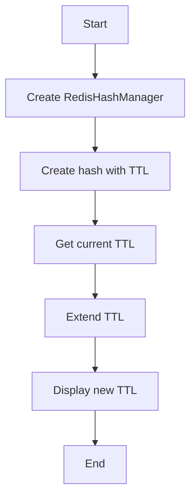

# Hash TTL Example

## Description

This example demonstrates managing TTL (time-to-live) on Redis hashes using `RedisHashManager`.

## Diagram



## Code

```python
from wredis.hash import RedisHashManager


def main():
    manager = RedisHashManager(host="localhost", verbose=False)

    manager.create_hash("temp:data", "key1", {"value": "expirable"}, ttl=10)

    ttl = manager.get_ttl("temp:data")
    print(f"TTL remaining: {ttl} seconds")

    manager.extend_ttl("temp:data", 60)
    new_ttl = manager.get_ttl("temp:data")
    print(f"New TTL: {new_ttl} seconds")


if __name__ == "__main__":
    main()
```

## Run Instructions

```bash
python example.py
```
