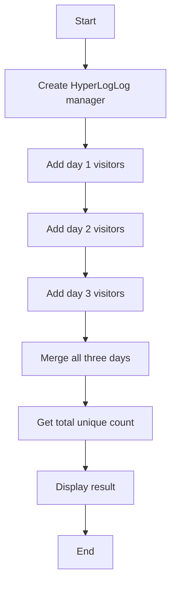

# HyperLogLog Merge Example

## Description

This example demonstrates merging multiple HyperLogLogs to count unique elements across different sets using `RedisHyperLogLogManager`.

## Diagram



## Code

```python
from wredis.hyperloglog import RedisHyperLogLogManager

hll = RedisHyperLogLogManager(host="localhost")

hll.add("day1", "user1", "user2", "user3")
hll.add("day2", "user3", "user4", "user5")
hll.add("day3", "user1", "user5", "user6")

hll.merge("total", "day1", "day2", "day3")

total_count = hll.count("total")
print(f"Total unique users across 3 days: {total_count}")
```

## Run Instructions

```bash
python example.py
```
