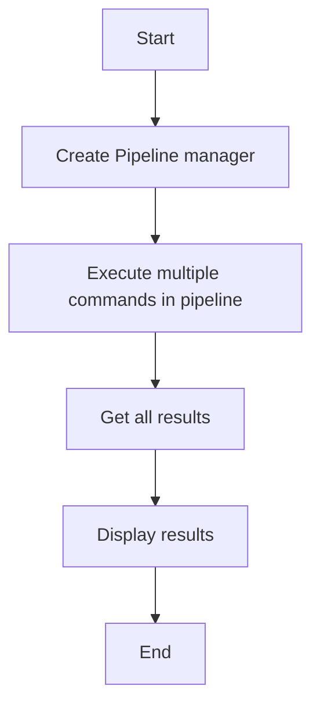

# Pipeline Basic Example

## Description

This example demonstrates executing multiple Redis commands in a pipeline using `RedisPipelineManager`. Pipelines allow batching multiple commands to reduce network round trips.

## Diagram



## Code

```python
from wredis.pipeline import RedisPipelineManager

pipeline = RedisPipelineManager(host="localhost")

results = pipeline.execute_commands(
    [
        ("set", ["key1", "value1"]),
        ("set", ["key2", "value2"]),
        ("get", ["key1"]),
        ("get", ["key2"]),
    ]
)
print(f"Results: {results}")
```

## Run Instructions

```bash
python example.py
```
