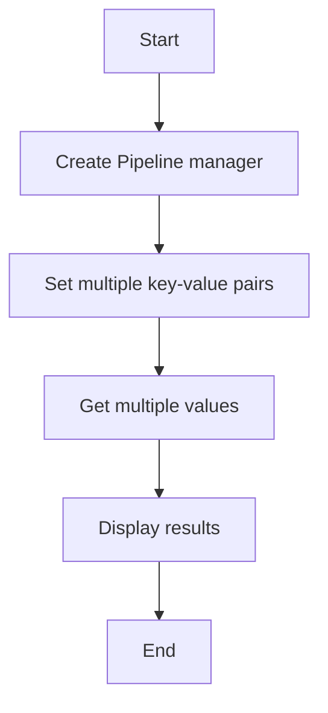

# Pipeline Batch Example

## Description

This example demonstrates batch operations using mset and mget with pipelines.

## Diagram



## Code

```python
from wredis.pipeline import RedisPipelineManager

pipeline = RedisPipelineManager(host="localhost")

mapping = {
    "user:1": '{"name": "Alice", "age": 30}',
    "user:2": '{"name": "Bob", "age": 25}',
    "user:3": '{"name": "Charlie", "age": 35}',
}
pipeline.mset_pipeline(mapping)

values = pipeline.mget_pipeline("user:1", "user:2", "user:3")
print(f"Values: {values}")
```

## Run Instructions

```bash
python example.py
```
