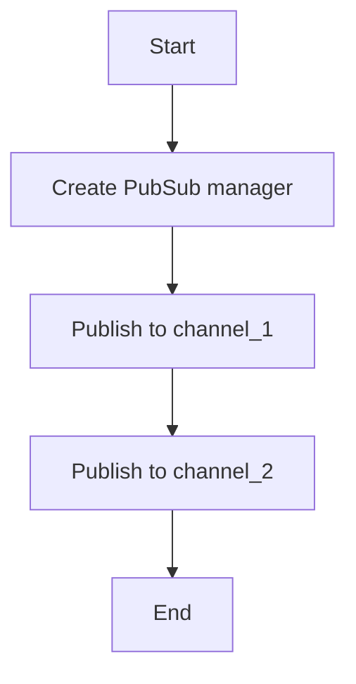

# Pub/Sub Publisher Example

## Description

This example demonstrates publishing messages to Redis channels using `RedisPubSubManager`.

## Diagram



## Code

```python
from wredis.pubsub import RedisPubSubManager

pubsub_manager = RedisPubSubManager(host="localhost")


pubsub_manager.publish_message("channel_1", "Hello, Redis!")


pubsub_manager.publish_message("channel_2", {"greeting": "Hello from channel_2!"})
```

## Run Instructions

```bash
python example.py
```

Run a subscriber first to receive the messages.
