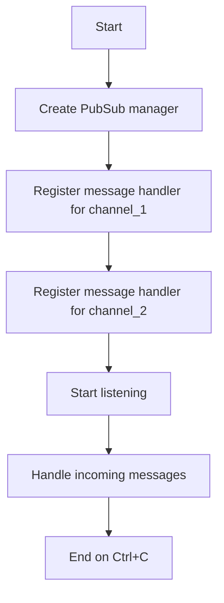

# Pub/Sub Subscriber Example

## Description

This example demonstrates subscribing to Redis channels and handling messages using `RedisPubSubManager`.

## Diagram



## Code

```python
import signal
import sys

from wredis.pubsub import RedisPubSubManager

pubsub_manager = RedisPubSubManager(host="localhost", verbose=False)


@pubsub_manager.on_message("channel_1")
def handle_message(message):
    print(f"[channel_1] Message received: {message}")


@pubsub_manager.on_message("channel_2")
def handle_channel_2(message):
    print(f"[channel_2] Message received: {message}")


def signal_handler(sig, frame):
    print("\nStopping program...")
    pubsub_manager.stop_listeners()
    print("Program stopped.")
    sys.exit(0)


signal.signal(signal.SIGINT, signal_handler)

signal.pause()
```

## Run Instructions

```bash
python example.py
```

Press Ctrl+C to stop.
