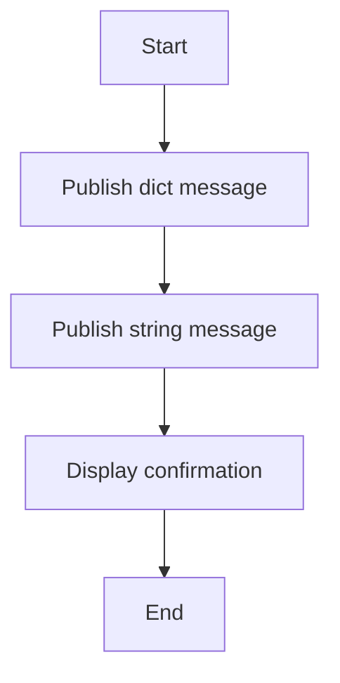

# Simple Pub/Sub Publisher Example

## Description

This example demonstrates a simple way to publish messages using the `publish` function from WRedis.

## Diagram



## Code

```python
"""Simple Pub/Sub Publisher Example"""

from wredis import publish

if __name__ == "__main__":
    publish("my_channel", {"message": "Hello from WRedis!"})
    publish("my_channel", "Simple string message")
    print("Messages published")
```

## Run Instructions

```bash
python example.py
```
