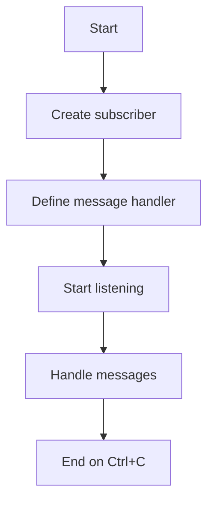

# Simple Pub/Sub Subscriber Example

## Description

This example demonstrates a simple way to subscribe to channels using the `subscribe` function from WRedis.

## Diagram



## Code

```python
"""Simple Pub/Sub Subscriber Example"""

import signal
from wredis import subscribe


def my_handler(message):
    print(f"Received: {message}")


if __name__ == "__main__":
    manager = subscribe("my_channel", my_handler)
    print("Listening... Press Ctrl+C to exit")
    manager.wait()
```

## Run Instructions

```bash
python example.py
```

Press Ctrl+C to stop.
