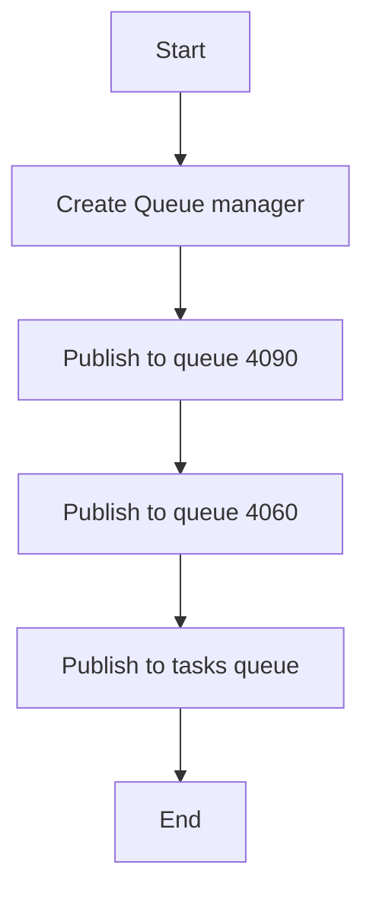

# Queue Producer Example

## Description

This example demonstrates producing messages to Redis queues using `RedisQueueManager`.

## Diagram



## Code

```python
from wredis.queue import RedisQueueManager

queue_manager = RedisQueueManager(host="localhost")

queue_manager.publish("4090", {"id": 1, "task": "process_image", "status": "pending"})
queue_manager.publish("4060", {"id": 2, "task": "generate_report", "priority": "high"})
queue_manager.publish(
    "queue:4060", {"id": 3, "task": "process_video", "status": "pending"}
)

queue_manager.publish("tasks", {"task_id": 3, "description": "Generate report"}, ttl=30)
queue_manager.publish(
    "tasks", {"task_id": 4, "description": "Update database"}, ttl=120
)
queue_manager.publish(
    "tasks",
    {
        "task_id": 4,
        "description": {"id": 2, "task": "generate_report", "priority": "high"},
    },
    ttl=10,
)
```

## Run Instructions

```bash
python example.py
```
