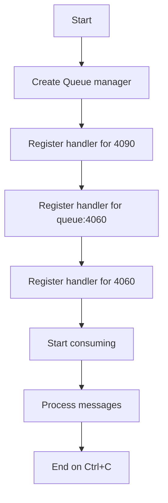

# Queue Consumer Example

## Description

This example demonstrates consuming messages from Redis queues using `RedisQueueManager`.

## Diagram



## Code

```python
from wredis.queue import RedisQueueManager

queue_manager = RedisQueueManager(poll_interval=2, host="localhost", verbose=False)


@queue_manager.on_message("4090")
def worker_4090(record):
    print(f"Processing from '4090': {record}")


@queue_manager.on_message("queue:4060")
def worker_queue_4060(record):
    print(f"Processing from 'queue:4060': {record}")


@queue_manager.on_message("4060")
def worker_4060(record):
    print(f"Processing from '4060': {record}")


queue_length = queue_manager.get_queue_length("tasks")


queue_manager.start()

queue_manager.wait()
```

## Run Instructions

```bash
python example.py
```

Press Ctrl+C to stop.
