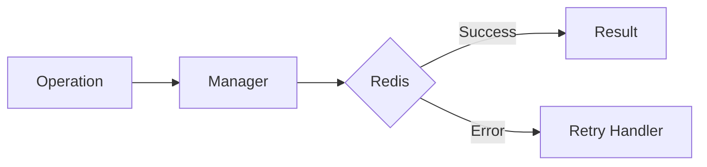

# 01 Basic Retry

## Description

Demonstrates basic usage of the @retry decorator that automatically retries failed operations up to a specified number of attempts.



## Code

See `example.py`

## Run

```bash
python example.py
```
