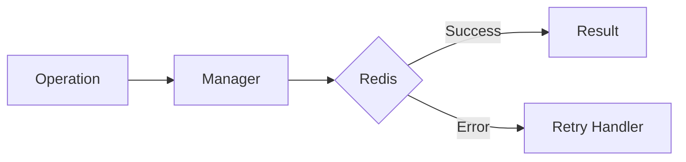

# 02 Custom Exceptions

## Description

Demonstrates configuring the @retry decorator to handle custom exception types beyond the default Redis exceptions.



## Code

See `example.py`

## Run

```bash
python example.py
```
