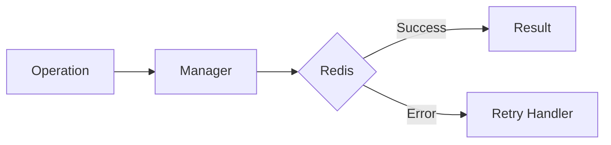

# 03 Backoff Timing

## Description

Demonstrates exponential backoff timing where the delay between retries increases exponentially with each attempt.



## Code

See `example.py`

## Run

```bash
python example.py
```
