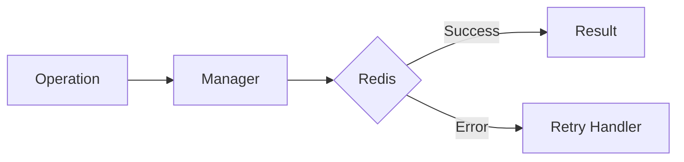

# 04 Redis Read Operations

## Description

Demonstrates using @retry decorator for Redis GET operations that may fail due to temporary connection issues.



## Code

See `example.py`

## Run

```bash
python example.py
```