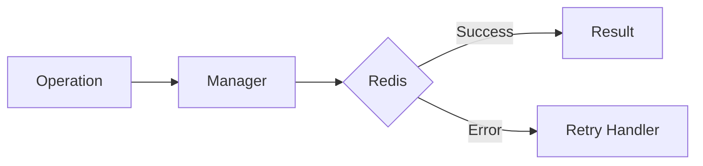

# 05 Redis Write Operations

## Description

Demonstrates using @retry decorator for Redis SET/HSET write operations that may fail and need safe retry mechanisms.



## Code

See `example.py`

## Run

```bash
python example.py
```
