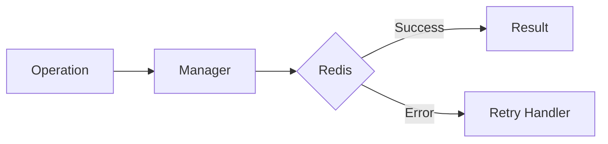

# 06 Database Connection

## Description

Demonstrates using @retry decorator for establishing resilient Redis connections that can recover from temporary network failures.



## Code

See `example.py`

## Run

```bash
python example.py
```