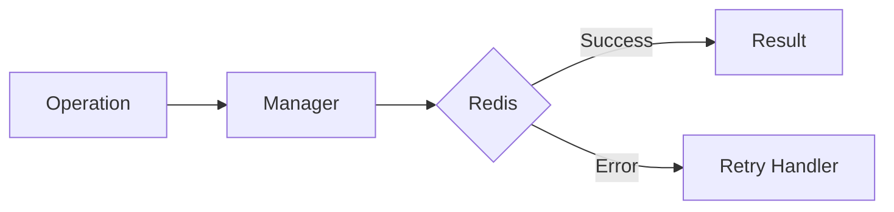

# 07 API Calls

## Description

Demonstrates using @retry for external API calls that may fail due to timeouts or connection errors.



## Code

See `example.py`

## Run

```bash
python example.py
```
