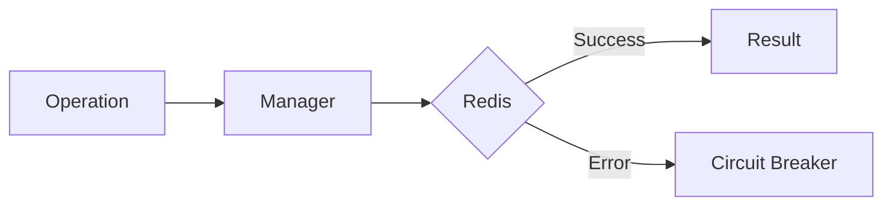

# 08 Circuit Breaker

## Description

Demonstrates implementing a circuit breaker pattern that stops retrying after too many consecutive failures to prevent cascading failures.



## Code

See `example.py`

## Run

```bash
python example.py
```