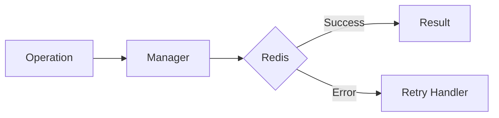

# 09 Retry with Logging

## Description

Demonstrates adding logging and monitoring to retry operations to track retry attempts and diagnose issues.



## Code

See `example.py`

## Run

```bash
python example.py
```
