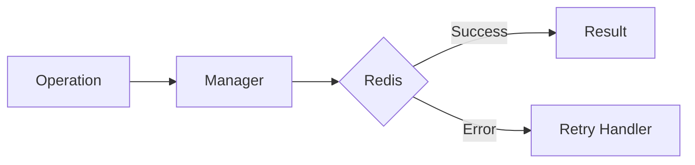

# 10 Retry with Wrapper

## Description

Demonstrates creating a custom wrapper decorator that combines @retry with additional logic like input validation.



## Code

See `example.py`

## Run

```bash
python example.py
```
