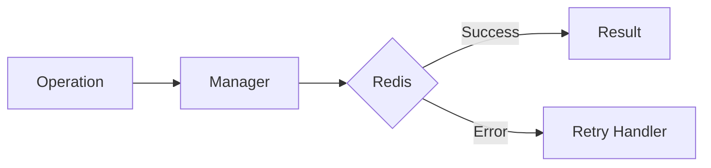

# 11 Batch Operations

## Description

Demonstrates applying @retry decorator to batch operations that process multiple elements, retrying the entire batch on failure.



## Code

See `example.py`

## Run

```bash
python example.py
```
