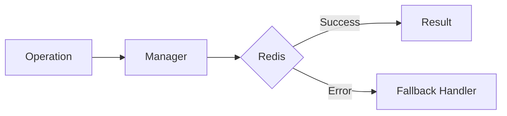

# 12 Retry with Fallback

## Description

Demonstrates a pattern where if Redis fails after all retries, a local in-memory cache is used as fallback.



## Code

See `example.py`

## Run

```bash
python example.py
```